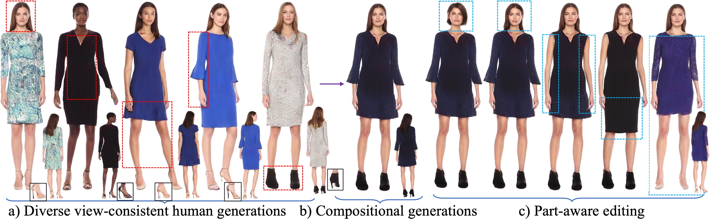

<div align="center">

# <b>StructLDM</b>: Structured Latent Diffusion for 3D Human Generation 

<h2>ECCV 2024</h2>

[Tao Hu](https://taohuumd.github.io/), [Fangzhou Hong](https://github.com/hongfz16), [Ziwei Liu](https://liuziwei7.github.io/)

[S-Lab, Nanyang Technological University](https://www.ntu.edu.sg/s-lab)

### [Project Page](https://taohuumd.github.io/projects/StructLDM/) · [Paper](https://arxiv.org/pdf/2404.01241) · [Video](https://www.youtube.com/watch?v=9GKdWVXcNqA)

</div>

## Introduction
We propose StructLDM, a structured latent diffusion model that learns 3D human generations from 2D images.



StructLDM generates diverse view-consistent humans, and supports different levels of controllable generation and editing, such as compositional generations by blending the five selected parts from a), and part-aware editing such as identity swapping, local clothing editing, 3D virtual try-on, etc. Note that the generations and editing are clothing-agnostic without clothing types or masks conditioning.


Generations on RenderPeople.

## Installation
NVIDIA GPUs are required for this project. We have trained and tested code on NVIDIA V100.  We recommend using anaconda to manage the python environments.

```bash
conda create --name structldm python=3.9
conda install pytorch==1.10.1 torchvision==0.11.2 cudatoolkit=11.1 -c pytorch
conda install -c fvcore -c iopath -c conda-forge fvcore iopath
conda install pytorch3d -c pytorch3d
pip install -r requirements.txt
```


## Implementation 

(under construction)

### Download Models & Assets & Datasets

Download the [pre-trained models](https://1drv.ms/f/s!Att91f8pjJXNnBnujIUpx1l4uzss?e=9beDrT) and [assets](https://1drv.ms/f/s!Att91f8pjJXNnBBDe3pVC-vTbG_a?e=WDcxSS). Put them in *DATA_DIR/result/trained_model* and *DATA_DIR/asset* respectively. *DATA_DIR* is specified as *../data* in default.
 
Register and download SMPL models [here](https://smpl.is.tue.mpg.de/). Put them in the folder *smpl_data*.

The folder structure should look like

```
DATA_DIR
├── dataset
└── asset/
    ├── smpl_data/
        └── SMPL_NEUTRAL.pkl
├── result/trained_model
```

### Commands

Inference script for trained models (e.g., RenderPeople).
```bash
bash scripts/renderpeople/test.sh gpu_ids
```

The inference results will be found in *DATA_DIR/result/*.


## License
Distributed under the S-Lab License. See `LICENSE` for more information.

SMPL-X related files are subject to the license of [SMPL-X](https://smpl-x.is.tue.mpg.de/modellicense.html).

## Citation
If you find our code or paper is useful to your research, please consider citing:
```bibtex
@misc{hu2024structldm,
      title={StructLDM: Structured Latent Diffusion for 3D Human Generation}, 
      author={Tao Hu and Fangzhou Hong and Ziwei Liu},
      year={2024},
      eprint={2404.01241},
      archivePrefix={arXiv},
      primaryClass={cs.CV}
  }
```